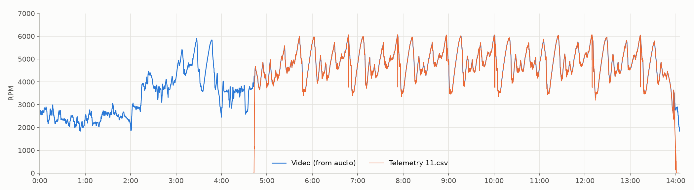

# kart-video-sync

Automatically match onboard kart videos to their data-logger telemetry and find the
exact time offset between them, using only the engine sound.

The video's audio is turned into an engine-RPM trace. That trace is then correlated
with the RPM channel of every telemetry file (MyChron / AiM CSV exports). The best
match wins, and the offset is refined to about ±0.01 s. Camera and logger clocks
typically drift by less than 1 ms over a session, so a single offset holds for the
whole video.

Useful for building data overlays (RaceRender, Telemetry Overlay, DashWare, your own
scripts) without lining up clips by hand.



*A 14-minute GoPro clip matched against ten telemetry files from the same weekend. Blue is the
RPM recovered from the camera's audio; orange is the logger's RPM channel shifted by
the detected offset (4:42.870, i.e. the logger started 4 min 42.870 s into the video). The two
traces overlap lap after lap. Before the logger starts, the blue trace shows the
pre-session idle and other karts nearby. The matching ignores that part.*

## Contents

| File | Purpose |
|---|---|
| `batch_sync.py` | **Main tool.** Matches every video in a folder and writes a copy of the matching telemetry CSV named after the video and offset. |
| `kart_sync.py` | Matches a single video and prints a ranking of all telemetry files, the offset, clock drift and an overlay plot. |
| `kart_rpm.py` | Extracts RPM from audio and plots it. The other two scripts import it. |
| `requirements.txt` | Python dependencies. |

Keep the three `.py` files in the same directory.

## Requirements

- Python 3.9+
- `numpy`, `scipy`, `matplotlib`
- [ffmpeg](https://ffmpeg.org/) on your `PATH` (recommended) to read audio straight from
  video files. Without it, the scripts fall back to `librosa`.

```bash
# install ffmpeg
brew install ffmpeg            # macOS (Homebrew)
sudo apt install ffmpeg        # Debian / Ubuntu
winget install ffmpeg          # Windows

# install Python packages
git clone <this repo>
cd kart-video-sync
python3 -m venv venv
source venv/bin/activate       # Windows: venv\Scripts\activate
pip install -r requirements.txt
```

## Input layout

Put the videos of one race day in a folder, with the telemetry exports in a
`telemetry/` subfolder:

```
race-day/
├── GX010027.MP4
├── GX010028.MP4
├── ...
└── telemetry/
    ├── session1.csv
    ├── session2.csv
    └── ...
```

- **Videos:** `.mp4`, `.mov` or `.m4v`, from any camera with a microphone (GoPro, DJI, phone…).
- **Telemetry:** AiM-format CSV (e.g. Race Studio → Export → CSV) with a `Time` column
  and an `RPM` channel. Any sample rate works.

## Usage

### Match every video in a folder

```bash
python batch_sync.py path/to/race-day
```

For each video that has a confident match, a copy of the telemetry file is written
next to the video:

```
GX010034 - 0m33s925ms.csv
GX010040 - 4m42s870ms.csv
```

The suffix is the **offset** as minutes, seconds and milliseconds: the point in the
video where telemetry time 0 happens. (File names use `m`/`s`/`ms` because `:` isn't
allowed in file names on Windows and shows up as `/` in the macOS Finder. On screen and
in the plots the same offset is shown as `m:ss.mmm`, e.g. `4:42.870`.)

```
video_time     = telemetry_time + offset
telemetry_time = video_time - offset
```

A negative offset (e.g. `GX010041 - -0m12s500ms.csv`) means the logger started before
the camera: video time 0 is 12.5 s into the telemetry.

The script also creates `race-day/sync_check/`:

- `<video> - sync.png`: video RPM plotted over telemetry RPM, for a visual check.
- `summary.csv`: per video, the matched file, the offset (both `m:ss.mmm` and plain
  seconds, for spreadsheets and scripts), correlation and status.

| Status | Meaning |
|---|---|
| `matched` | Confident match; CSV copy written. |
| `check: X.csv almost as good` | Copy written, but another file matched nearly as well. Check the plot. |
| `no match` | No telemetry file fits (e.g. the logger wasn't running). Nothing written. |
| `too short` | Clip under 2 minutes; too little data to match reliably. |

Options:

| Flag | Default | |
|---|---|---|
| `--telemetry DIR` | `<folder>/telemetry` | Where the CSV files are. |

### Several race days at once

```bash
for d in path/to/races/*/; do
  [ -d "$d/telemetry" ] || continue
  python batch_sync.py "$d"
done
```

### Inspect a single video

```bash
python kart_sync.py race-day/GX010034.MP4                 # uses race-day/telemetry/
python kart_sync.py GX010034.MP4 --dir path/to/csvs --show
```

This prints every telemetry file ranked by correlation, the best offset and clock drift.
It saves `<video>_sync.png` and `<video>_sync.csv`. The CSV pairs every video timestamp
(20 per second) with the corresponding telemetry time and both RPM values.

### Just extract RPM from audio

```bash
python kart_rpm.py onboard.mp4            # -> onboard_rpm.png + onboard_rpm.csv
python kart_rpm.py onboard.mp4 --debug    # + spectrogram with the tracked harmonics
```

| Flag | Default | |
|---|---|---|
| `--rpm-min`, `--rpm-max` | 1500, 6500 | RPM search range. |
| `--max-rate` | 5000 | Maximum RPM change per second the tracker allows. |
| `--show` | | Open an interactive plot window. |

## How it works

1. **RPM from audio.** A single-cylinder four-stroke fires once every two crank
   revolutions, so the exhaust note is a harmonic series with fundamental
   `f0 = RPM / 120` Hz (12.5–54 Hz for 1500–6500 RPM). The audio is decoded at 8 kHz
   and turned into a spectrogram (0.4 s window, 20 frames/s). The spectrum is
   whitened, and every candidate RPM is scored by the energy on its harmonics.
   A Viterbi tracker with a limited RPM slew rate picks the smoothest high-scoring
   path, which bridges braking, wind noise and passing karts.
2. **Find the file.** The audio RPM trace is slid along each telemetry RPM trace, and
   the masked normalised cross-correlation is computed at every lag (via FFT). Only
   samples where the logger saw the engine running (RPM > 500) count.
3. **Verify and refine.** The top candidates are re-aligned independently in 60 s
   windows at 5 ms resolution. A true match has most windows agreeing on one offset.
   A lookalike session at the same track gives scattered offsets and is rejected.
   The final offset is the median of the agreeing windows, and a linear fit across
   them gives the clock drift.

## Limitations

- **Engine type:** tuned for single-cylinder four-strokes (e.g. Briggs 206, LO206,
  Honda GX rental karts). For a single-cylinder two-stroke the fundamental is
  `RPM / 60`. Change the `/ 120` in `kart_rpm.py` (`harmonic_salience` and
  `plot_debug`) and revisit `octave_guard`.
- **Idle and pit lane** are the least accurate parts of the audio RPM. Nearby engines
  interfere, and many camera microphones cut off below ~30 Hz. This barely affects
  matching, which is driven by on-track laps.
- **Short clips** (2–4 min) can resemble other sessions at the same track. If the
  summary says `check`, look at the plot.
- **Waterproof housings** muffle audio a lot. Results are best with an open/vented
  frame or the camera's built-in mic unobstructed.
- **Speed:** each long video takes a minute or two, mostly reading the file from
  disk. Files in cloud storage (iCloud, OneDrive, …) are downloaded first.

## License

MIT, see [LICENSE](LICENSE).
